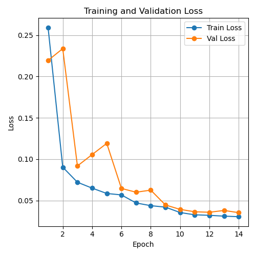
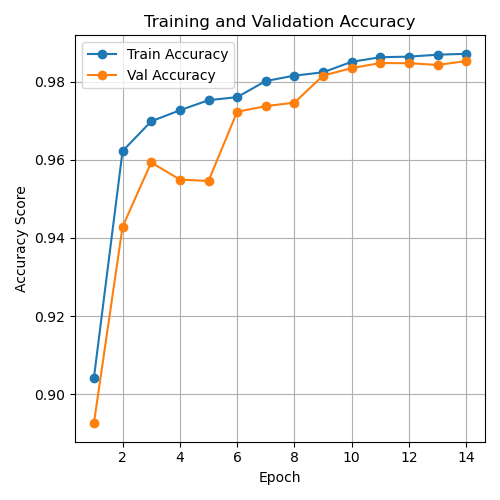
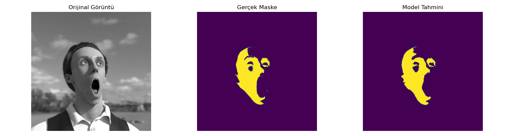
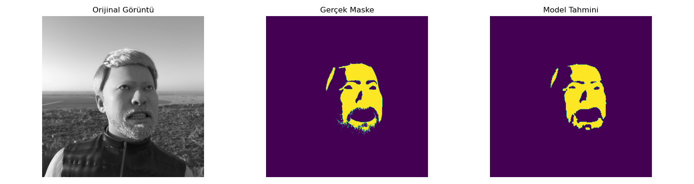

# 🧠 ResNet50-UNet: Derin Özellik Öğrenimi ile Görüntü Segmentasyonu

Bu proje, **ResNet50** tabanlı bir encoder ile **U-Net tipi** bir decoder'ı birleştirerek hassas görüntü segmentasyonu yapabilen hibrit bir model sunar. Derin katmanlardan gelen semantik bilgi, sığ katmanlardaki detaylarla birleştirilerek yüksek doğrulukta segmentasyon çıktıları elde edilir.

---

## 🗂️ Veri Kümesi

Bu çalışmada kullanılan görüntüler, Microsoft tarafından sunulan **Fake It Till You Make It: Face analysis in the wild using synthetic data alone.** başlıklı çalışmadan alınmıştır.

- Toplam **500 gölgeli yüz görüntüsü** kullanıldı.
- Tüm görüntüler **otomatik anote edilmiştir**.
- Veri kümesi aşağıdaki şekilde bölünmüştür:

| Küme        | Görüntü Sayısı |
|-------------|----------------|
| Eğitim (Train)     | 350 (%70)          |
| Doğrulama (Validation) | 75   (%15)           |
| Test               | 75  (%15)              |

> ✍️ Anotasyon işlemi, her bir gölge maskesinin piksel seviyesinde dikkatlice etiketlenmesiyle gerçekleştirilmiştir. Bu sayede model, ışık-gölge ayrımını yüksek hassasiyetle öğrenmiştir.

---

## 🧬 Mimari Yapısı

Model iki temel bileşenden oluşur:

- 🔷 **Encoder**: ImageNet üzerinde önceden eğitilmiş ResNet50 ile güçlü semantik özellik çıkarımı.
- 🔶 **Decoder**: U-Net tarzı birleştirici yapı ile uzamsal çözünürlüğün geri kazanımı ve maskelerin hassas üretimi.

Bu mimari, klasik U-Net yapısından türetilmiş bir **U-Net benzeri (U-Net-like)** yapıdır. Modelin çıkış kanal sayısı ve boyutunun girişle tam eşleşmesini sağlamak amacıyla:

- Ek bir **upsampling (yeniden ölçekleme)** katmanı kullanılmış,
- Decoder tarafında, **skip connection yapılmayan ara katmanda**, kanal boyutu klasik double convolution bloklarına uymadığı için, **özellik haritalarını hizalamak amacıyla bir 1×1 konvolüsyon** uygulanmıştır.

Bu esneklik, mimarinin hem U-Net’in temel karakteristiklerini (örneğin skip connection yapısı) korumasını hem de uygulamaya özel gereksinimlere uyum sağlamasını mümkün kılar.

---

## 📊 Değerlendirme Sonuçları

Modelin test kümesi üzerinde elde ettiği başlıca metrikler:

| Metrik              | Değer       |
|---------------------|-------------|
| Test Loss           | 0.0359      |
| Test Accuracy       | 0.9846      |
| Dice Coefficient    | 0.9081      |
| IoU (Jaccard)       | 0.8325      |
| Surface Dice        | 0.8098      |

---

## 📉 Öğrenme Süreci

Aşağıda modelin eğitim sürecinde kaydedilen **loss**, **accuracy** ve **dice skoru** grafiklerinden örnekler verilmiştir:

### 🔺 Loss Grafiği

### ✅ Accuracy Grafiği

### 🔵 Dice Skoru

---

## 🖼️ Örnek Segmentasyon Sonuçları

Modelin bazı örnek giriş / gerçek maske / tahmin çıktıları:

| Tahmin Görselleri        |
|---------------------------------------------|
|   |
|   |

---

## 📚 Kaynaklar

- **U-Net**: Ronneberger et al., *Convolutional Networks for Biomedical Image Segmentation*, 2015.
- **ResNet**: He et al., *Deep Residual Learning for Image Recognition*, 2016.
- **Dataset**: Microsoft Research, *Fake It Till You Make It: Face analysis in the wild using synthetic data alone*, 2021.

---

> 👨‍💻 Geliştiren: [Burak ÖZDEMİR]  
> 📌 Akademik katkı olarak sunulmuş ve deneysel sonuçlar başarıyla raporlanmıştır.

